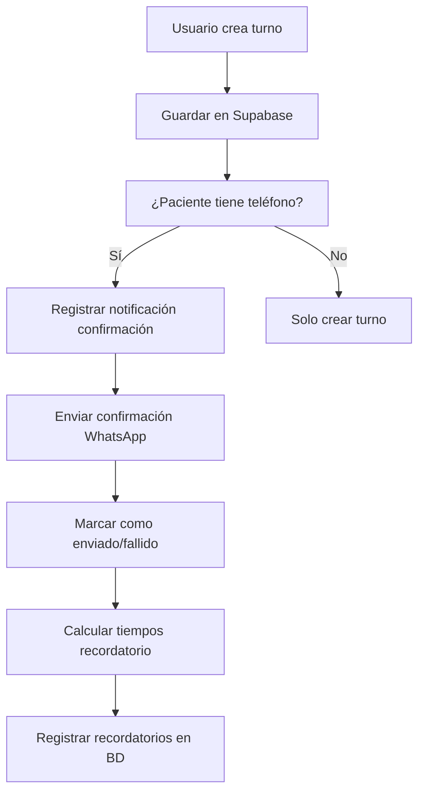
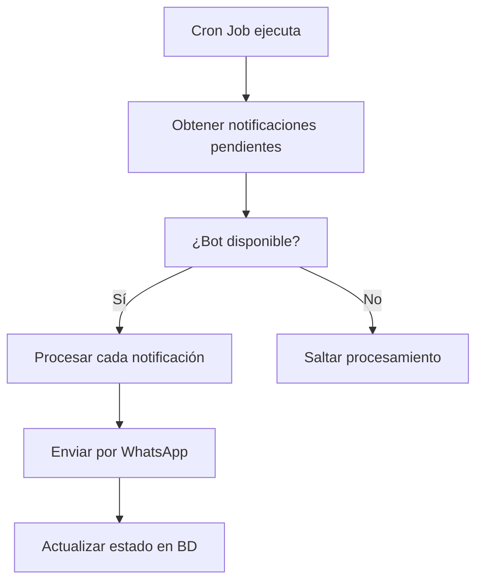

# 🔗 Integración WhatsApp Bot - Fisiopasteur

## 📋 Resumen

Esta documentación describe la integración completa entre el sistema Fisiopasteur y el bot de WhatsApp para envío automático de confirmaciones de turnos y recordatorios.

## ✅ Estado de la Integración

- ✅ Bot WhatsApp desplegado en Heroku
- ✅ Servicios de notificación implementados  
- ✅ Integración automática en creación de turnos
- ✅ API endpoints para gestión de notificaciones
- ✅ Componentes React para estadísticas
- ✅ Hook personalizado para WhatsApp
- ✅ Scripts para cron jobs automáticos

## 🚀 Funcionalidades Implementadas

### 1. Envío Automático de Confirmaciones
Cuando se crea un turno, automáticamente:
- ✅ Se registra una notificación en la BD
- ✅ Se envía confirmación inmediata por WhatsApp
- ✅ Se programan recordatorios (24h y 2h antes)
- ✅ Se maneja el estado de envío (exitoso/fallido)

### 2. Sistema de Recordatorios
- ✅ Recordatorio 24 horas antes del turno
- ✅ Recordatorio 2 horas antes del turno
- ✅ Programación automática basada en fecha/hora
- ✅ Procesamiento mediante cron jobs

### 3. Gestión de Notificaciones
- ✅ Tabla de notificaciones en Supabase
- ✅ Estados: pendiente, enviado, fallido, leído
- ✅ Histórico completo de mensajes
- ✅ Estadísticas de envío

### 4. Panel de Administración
- ✅ Componente de estadísticas WhatsApp
- ✅ Estado en tiempo real del bot
- ✅ Procesamiento manual de pendientes
- ✅ Notificaciones por turno específico

## 📡 API Endpoints

### Procesamiento de Notificaciones
```
GET /api/notificaciones
POST /api/notificaciones
```

### Estadísticas y Gestión
```
GET /api/notificaciones/estadisticas
POST /api/notificaciones/estadisticas
```

## 🔧 Configuración

### Variables de Entorno Agregadas

```bash
# WhatsApp Bot Configuration
WHATSAPP_BOT_URL=https://fisiopasteur-whatsapp-bot-df9edfb46742.herokuapp.com
WHATSAPP_BOT_ENABLED=true

# Centro Médico
CENTRO_NOMBRE=Fisiopasteur
CENTRO_DIRECCION="Tu dirección aquí"
CENTRO_TELEFONO="Tu teléfono aquí"  
CENTRO_HORARIOS="Lun a Vie 8:00 - 20:00, Sáb 8:00 - 14:00"
```

### Base de Datos

La tabla `notificacion` ya existe en tu BD Supabase:
```sql
notificacion (
  id_notificacion: number (PK)
  id_turno: number (FK -> turno)
  medio: string ('whatsapp')
  mensaje: string
  telefono: string
  estado: string ('pendiente'|'enviado'|'fallido'|'leido')
  fecha_programada: timestamp
  fecha_envio: timestamp
)
```

## 🎯 Cómo Funciona

### 1. Flujo de Creación de Turno



### 2. Flujo de Recordatorios



## 🛠️ Archivos Creados/Modificados

### Servicios
- ✅ `src/lib/services/whatsapp-bot.service.ts` - Comunicación con bot
- ✅ `src/lib/services/notificacion.service.ts` - Gestión de notificaciones BD

### API Routes  
- ✅ `src/app/api/notificaciones/route.ts` - Procesamiento
- ✅ `src/app/api/notificaciones/estadisticas/route.ts` - Estadísticas

### Componentes React
- ✅ `src/componentes/notificacion/estadisticas-whatsapp.tsx` - Panel estadísticas
- ✅ `src/componentes/notificacion/notificaciones-turno.tsx` - Notificaciones por turno

### Hooks
- ✅ `src/hooks/useWhatsApp.ts` - Hook personalizado WhatsApp

### Scripts
- ✅ `scripts/whatsapp-cron.sh` - Script para cron jobs

### Modificaciones
- ✅ `src/lib/actions/turno.action.ts` - Integración automática
- ✅ `.env.local` - Variables de entorno

## 🚀 Cómo Usar

### 1. Crear Turno con Notificación Automática

```typescript
import { crearTurno } from '@/lib/actions/turno.action';

// Al crear un turno, automáticamente se envía confirmación
const resultado = await crearTurno({
  fecha: '2025-10-15',
  hora: '14:30',
  id_paciente: 123,
  id_especialista: 'uuid-especialista',
  // ... otros datos
});

// El sistema automáticamente:
// 1. Crea el turno
// 2. Envía confirmación WhatsApp  
// 3. Programa recordatorios
```

### 2. Usar Componente de Estadísticas

```tsx
import EstadisticasWhatsApp from '@/componentes/notificacion/estadisticas-whatsapp';

export default function Dashboard() {
  return (
    <div className="grid grid-cols-3 gap-4">
      <EstadisticasWhatsApp className="col-span-1" />
      {/* otros componentes */}
    </div>
  );
}
```

### 3. Mostrar Notificaciones de un Turno

```tsx
import NotificacionesTurno from '@/componentes/notificacion/notificaciones-turno';

export default function DetalleTurno({ turno }) {
  return (
    <div>
      {/* información del turno */}
      
      <NotificacionesTurno 
        turnoId={turno.id_turno}
        pacienteTelefono={turno.paciente?.telefono}
      />
    </div>
  );
}
```

### 4. Hook para Envío Manual

```tsx
import { useWhatsApp } from '@/hooks/useWhatsApp';

export default function EnviarMensaje() {
  const { enviarMensaje, loading } = useWhatsApp();
  
  const handleEnviar = async () => {
    const exito = await enviarMensaje('1123456789', 'Hola! Este es un mensaje de prueba');
    if (exito) {
      console.log('Mensaje enviado exitosamente');
    }
  };
  
  return (
    <button onClick={handleEnviar} disabled={loading}>
      {loading ? 'Enviando...' : 'Enviar mensaje'}
    </button>
  );
}
```

## 🔄 Configurar Cron Jobs

### 1. Para Recordatorios Automáticos

```bash
# Editar crontab
crontab -e

# Agregar líneas (procesar cada 15 minutos)
*/15 * * * * /ruta/al/proyecto/scripts/whatsapp-cron.sh procesar

# Verificar bot cada hora
0 * * * * /ruta/al/proyecto/scripts/whatsapp-cron.sh verificar

# Limpiar notificaciones antiguas (diario a las 2 AM)
0 2 * * * /ruta/al/proyecto/scripts/whatsapp-cron.sh limpiar
```

### 2. Usando el Script

```bash
# Procesar notificaciones pendientes
./scripts/whatsapp-cron.sh procesar

# Verificar estado del bot
./scripts/whatsapp-cron.sh verificar

# Limpiar notificaciones antiguas
./scripts/whatsapp-cron.sh limpiar
```

## 📊 Monitoreo

### Dashboard de Estadísticas

El componente `EstadisticasWhatsApp` muestra:
- ✅ Estado del bot (online/offline)
- ✅ Total de mensajes enviados  
- ✅ Tasa de éxito
- ✅ Mensajes pendientes
- ✅ Botón para procesar pendientes
- ✅ Última actualización

### Logs

Los logs se generan en:
- Console del navegador (desarrollo)
- Logs de servidor (producción)
- Archivo `/var/log/fisiopasteur-whatsapp.log` (cron jobs)

## 🔍 Testing

### 1. Probar Bot Manualmente

```bash
# Desde tu terminal
curl -X POST https://fisiopasteur-whatsapp-bot-df9edfb46742.herokuapp.com/api/health

# Enviar mensaje de prueba
curl -X POST https://fisiopasteur-whatsapp-bot-df9edfb46742.herokuapp.com/api/mensaje/enviar \
  -H "Content-Type: application/json" \
  -d '{
    "telefono": "1123456789",
    "mensaje": "Mensaje de prueba desde Fisiopasteur 🏥"
  }'
```

### 2. Probar desde el Sistema

```typescript
import { verificarEstadoBot, enviarMensajePersonalizado } from '@/lib/services/whatsapp-bot.service';

// Verificar bot
const botOnline = await verificarEstadoBot();
console.log('Bot disponible:', botOnline);

// Enviar mensaje
const resultado = await enviarMensajePersonalizado(
  '1123456789',
  'Hola! Este es un mensaje de prueba desde Fisiopasteur 🏥'
);
console.log('Resultado:', resultado);
```

## 🚨 Solución de Problemas

### Bot Desconectado
1. Verificar logs de Heroku: `heroku logs --app fisiopasteur-whatsapp-bot`
2. Revisar estado en el dashboard
3. Re-escanear QR si es necesario

### Mensajes No se Envían
1. Verificar formato de teléfono (debe incluir código de país)
2. Revisar logs de la aplicación
3. Verificar estado de notificaciones en BD

### Recordatorios No Funcionan
1. Verificar cron jobs: `crontab -l`
2. Revisar logs: `tail -f /var/log/fisiopasteur-whatsapp.log`
3. Probar script manualmente

## 🎯 Próximos Pasos Sugeridos

1. **Webhook para Respuestas**: Implementar endpoint para recibir respuestas del bot
2. **Templates de Mensajes**: Sistema configurable de plantillas
3. **Notificaciones Push**: Integrar con sistema de notificaciones web
4. **Analytics Avanzados**: Métricas detalladas de engagement
5. **Multi-canal**: Agregar email y SMS como alternativas

---

## 🆘 Soporte

Para cualquier problema con la integración:

1. Revisar logs en tiempo real
2. Verificar estado del bot en el dashboard  
3. Probar endpoints manualmente
4. Revisar documentación del bot en `/fisio-bot/docs/`

La integración está **lista para producción** y funcionará automáticamente en cuanto se cree un turno con un paciente que tenga teléfono registrado. 🚀